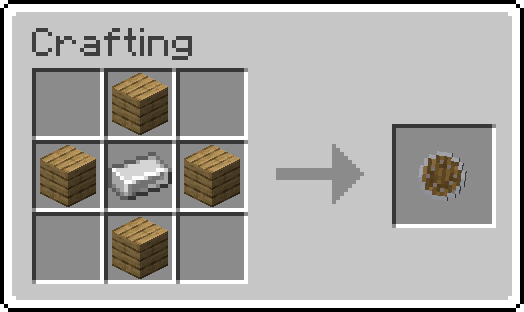
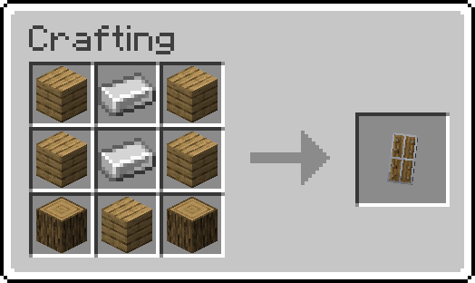
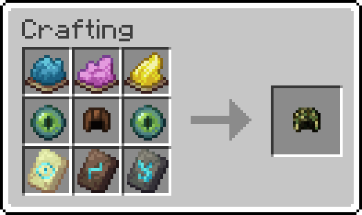
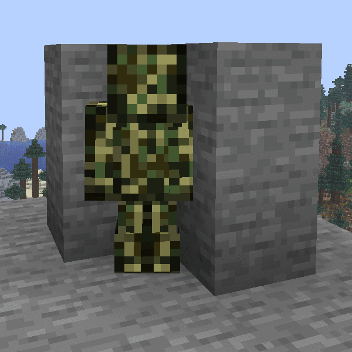

# Minecraft Fancy Combat Datapack

<em>Created by FancyPotatOS</em>

More shields and combat mechanics for tools!

Also adds a wand and camoflauge outfit!

## Tool Changes

### Pickaxe
When hit, gives Blindness for 1 second

This isn't enough to cause visual changes, however it prevents players from starting a sprint!

### Shovel
When hit, gives Weakness II for 1 second

### Hoe
Increased range, attack speed, and attack damage

### Shears
When hit, reduces block interaction range by 1.5 blocks for 1.5 seconds

### Brush
When hit, reduces entity interaction range by 1.5 blocks for 2.5 seconds

## New items

### Buckler
- 150 Durability
- No startup delay
- Reduces all attack damage by 3 hearts
- 1:3 disable time
- Is damaged 1:1 with damage taken

### Tower Shield
- 450 Durability
- Half a second startup delay
- 90% damage reduction
- 1:5 disable time
- Is damaged 1:1 with damage taken
- Reduces movement speed by ~37%
- Reduces entity interaction range by half a block

## Camoflauge

This armor allow you to hide yourself as blocks - simply crouch with your back against a block and you'll take on its appearance. While you're wearing the entire set, you'll get permanent invisibility to hide your nametag.

To reset the appearance, press Crouch+Sprint+Jump at the same time

The strength is between gold and iron.

## Wands

Wands are special items that gives you access to projectiles or abilities that you normally couldn't use. Casting them costs durability.

The 'Untrimmed Wand'  can be used with a trim in your offhand to set the ability. They can have Unbreaking and Mending applied to it using an anvil.

They are found in the following chests
- Ancient City (1:7)
- Hoglin Stables (1:2)
- Bastion Treasure Room (1:2)
- Desert Pyramid (1:4)
- End City Treasure (1:5)
- Jungle Temple (1:2)
- Pillager Outpost (1:7)
- Stronghold Library (1:2)
- Woodland Mansion (1:2)

### Bolt 

Cost: 8\
Cooldown: 1s

Changes the appearance of nearby creatures (Like horses, tropical fish, cats, etc.)

### Coast 

#### Not Sneaking
Cost: 8\
Cooldown: 30s

Freezes the water around nearby creatures 

#### Sneaking
Cost: 64 and a Heart of the Sea \
Cooldown: 20 minutes (For this ability)

Starts a Lightning Storm 

### Dune 

Cost: 32 and TNT \
Cooldown: None

Places a TNT trap when stepped on. Placer cannot trigger it for 5 seconds

### Eye 

Cost: 32\
Cooldown: 30s

Shoots an Enderdragon Fireball 

### Flow 

Cost: 16 and either a Lingering Potion  or Arrow \
Cooldown: 15s

Places an Ominous Item Spawner over nearby entities

### Host 

Cost: 1 and a Bundle \
Cooldown: None

Places the bundle sand or gravel, suspiciously! 

### Raiser 

_No current functionality yet... I forgot this one!_

### Rib 

#### Not Sneaking
Cost: 8\
Cooldown: 10s

Shoots a Wither Skull 

#### Sneaking
Cost: 24\
Cooldown: 20s

Shoots a Blue Wither Skull 

### Sentry 

Cost: 24\
Cooldown: 30s

Summons a forcefield that reflects all projectiles. Effect lasts for 5-10s

### Shaper 

Cost: 8 and Scaffolding\
Cooldown: None

Places a falling block trap when stepped on. Placer cannot trigger it for 5 seconds

The block must be mineable by a stone pickaxe

### Silence 

Cost: 48\
Cooldown: 30s (10s if missed)

Continue using for 2s to launch a Sonic Boom up to 25 blocks towards the entity you're looking at

### Snout 

#### Not Sneaking
Cost: 16\
Cooldown: 10s

Shoots Fireballs  like a Blaze

#### Sneaking
Cost: 24\
Cooldown: 20s

Shoots a Fireball  like a Ghast

### Spire 

Cost: 16\
Cooldown: 10s

Shoots a Shulker Bullet  that targets the nearest entity, with the attacker as the lowest priority

### Tide 

Cost: 8\
Cooldown: 30s

Boosts the player's water-related attributes for 7.5-15 seconds:
- Submerged Mining Speed (+40%)
- Underwater Movement (+80%)
- No Burn Time
- Oxygen Bonus (80% chance not to consume air)

### Vex 

Cost: 24\
Cooldown: 10s

Performs an Evoker Fang  attack up to 16 blocks

### Ward 

Cost: 24\
Cooldown: 15s

Senses grounded movement for 10-20s. Produces sculk sounds and vibration effects  towards all nearby motion. Any creatures that made a sound do not trigger this again for 5s

### Wayfinder 

Cost: 1\
Cooldown: 1s

Shoots a Llama Spit 

### Wild 

Cost: 4 and an arrow \
Cooldown: None

Places an arrow trap when stepped on. Placer cannot trigger it for 5 seconds

If buried, the trap will activate when the block is mined instead

## Credits

**In this datapack comes packaged the [Iris pathfinding datapack](https://github.com/Aeldrion/Iris) by Aeldrion**

**In this datapack comes packaged the [BlockState datapack](https://github.com/Triton365/BlockState) by Triton365**
